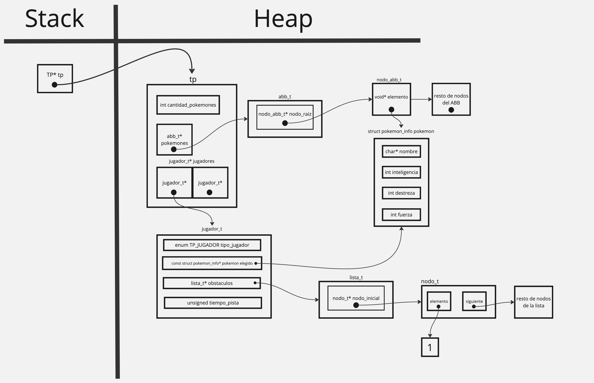
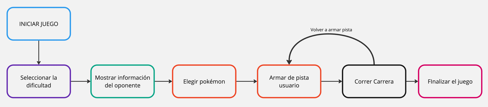

# TP: Carrera de obstáculos

## Repositorio de Lucas Martín Areco Gonzalez - 111203 - lareco@fi.uba.ar

- Para compilar:

```bash
gcc -std=c99 -Wall -Wconversion -Wtype-limits -pedantic -Werror -O2 -g src/*.c juego.c -o juego
```

- Para ejecutar: 
(Puedes pasarle el archivo con los pokemones que quieras)
```bash 
./juego pokemones.txt
```

- Para ejecutar con valgrind:
```bash
valgrind ./juego pokemones.txt
```
---
##  Implementación TDA TP

El TDA TP es la estructura central para el funcionamiento del juego. Aquí se inicializan los datos de los pokemones y los jugadores. En primer lugar, se carga la información de los pokémon desde el archivo proporcionado como parámetro. Para cada pokémon, se crea un ```struct pokemon_info``` en el que se almacenan todos sus datos.
```c
struct tp {
    abb_t *pokemones;
    jugador_t *jugadores[CANTIDAD_JUGADORES];
    int cantidad_pokemones;
};
``` 
En ```struct tp``` se utiliza la estructura ```abb_t``` para guardar la información de los pokemones. Esto se debe a que, en múltiples ocasiones, es necesario buscar datos específicos de un pokémon, y la complejidad computacional de un árbol binario de búsqueda es mejor que la de una lista para estas operaciones. Además, se definió una función que devuelva una cadena con los nombres de los pokemones en orden alfabético y el recorrido INORDEN sobre un árbol facilita muchisimo esta operación. 

Por otro lado, para los jugadores se agregó en la estructura un vector de punteros a ```jugadores_t```. La cantidad de jugadores es dos. Aquí se presentan los campos de la estructura. A esta estructura solo accede el tp y no es pública.

```c
typedef struct jugador {
	enum TP_JUGADOR tipo_jugador;
	const struct pokemon_info *pokemon_elegido;
	lista_t *obstaculos;
	unsigned tiempo_pista;
} jugador_t;
```
En primer lugar cada jugador posee un tipo para poder diferenciarse de los otros jugadores. En este caso, puede ser jugador 1 o jugador 2. También, se le agrega un campo para el pokémon que se selecciona en algun momento, así se puede controlar los pokémones que son asignados a los jugadores. Luego, se utiliza la estructura ```lista_t``` para guardar los obstáculos de la pista del jugador. Aquí se usa una lista ya que de todas formas se deben recorrer todos los obstáculos para calcular el tiempo por cada uno y el tiempo total por finalizar el recorrido de la pista. Este tiempo que tarda el jugador en recorrer la pista también se guarda en ```jugador_t```. Aquí se puede ver un diagrama conceptual de las estructuras en la memoria.

<div align="center">

</div>

###

Como un par de funciones generan una cadena de caracteres o de números a partir de datos de los pokemones, jugadores o incluso de la pista de obstáculos, se estableció una estructura privada llamada ```cadena_t```. 

```c
typedef struct cadena {
	TP *tp;
	char *palabras;
	char separador;
	bool hay_conversion;
} cadena_t;
```

Uno de sus campos es el ```TP``` para poder acceder rapidamente en la implementación a toda la información quie despues va a servir para armar la cadena. Obviamente una cadena tiene palabras (que en este caso podrían ser números también). Luego se le pasa un separador porque si se desea que las palabras esten concatenadas por algún caracter como ',' o '.', se puede definir aquí. Por último se le puede asignar si para llenar esa cadena hay una conversión o no. Esto fue muy útil para la función ```bool llenar_cadena_letras```.

--- 
## Complejidades de las funciones del TDA TP

| Función                     | Complejidad                                                                                          
|-----------------------------|------------------------------------------------------------------------------------------------------|
| ```tp_crear```              | O(n log(n)). Considerando un ABB balanceado, la inserción tiene una complejidad de O(log(n)), pero por cada pokémon se realiza una inserción en el ABB, por lo que la complejidad final es O(n log(n)). El resto de las funciones no afectan significativamente a la complejidad. |
| ```tp_cantidad_pokemon```   | O(1). Se accede directamente desde la estructura del TP a la cantidad de pokémones.                  |
| ```tp_buscar_pokemon```     | O(log(n)). Al utilizar un ABB para la búsqueda de los pokémones, a medida que descendemos en el árbol vamos descartando ramas, por lo que la complejidad se mantiene en O(log(n)). |
| ```tp_nombres_disponibles```| O(n). Se recorren todos los pokémones del ABB para agregarlos a una cadena dinámica.                  |
| ```tp_seleccionar_pokemon```| O(log(n)). Utiliza la función ```tp_buscar_pokemon``` para encontrar el pokémon que se quiere seleccionar. Luego, la asignación del pokémon al jugador es O(1). |
| ```tp_pokemon_seleccionado```| O(1). Se accede directamente al ```jugador_t``` del TP para obtener el pokémon seleccionado.         |
| ```tp_agregar_obstaculo```  | O(n). Como se utiliza una lista simplemente enlazada, en el peor caso (si se inserta en medio de la lista), la inserción es O(n). El resto de las operaciones son O(1). |
| ```tp_quitar_obstaculo```   | O(n). Similar a ```tp_agregar_obstaculo```, pero en este caso se elimina el obstáculo.               |
| ```tp_obstaculos_pista```   | O(n). Al recorrer una lista de obstáculos, se pasa por todos los elementos para construir la cadena resultante. |
| ```tp_limpiar_pista```      | O(n). Se recorren todos los obstáculos de una lista y se eliminan.                                   |
| ```tp_calcular_tiempo_pista```| O(n). Se recorren todos los obstáculos de la pista para calcular el tiempo total de la pista.        |
| ```tp_tiempo_por_obstaculo```| O(n). Se debe acceder a cada obstáculo para calcular su tiempo individual, recorriendo toda la lista de obstáculos. |
| ```tp_destruir```           | O(n). Se deben recorrer todas las estructuras (ABB y listas) para liberar la memoria reservada tanto para los pokémones como para las dos pistas de los jugadores. Además, se libera la memoria del propio TP. |

<br>

## Implementación TDA MENU

Además del TDA TP, se implementó un TDA MENU para poder manejar las entradas del usuario en el juego. Lo importante en este TDA es que su implementación permita que el menú pueda ser reutilizado en cualquier proyecto, es decir, no va a depender de las funciones del TP.
 <br>

```c
struct menu {
	hash_t *comandos;
};

typedef struct comando_info {
	char *descripcion;
	bool (*funcion)(void *);
} comando_info_t;
```
En realidad, la estructura de `menu` utiliza un hash por detrás para asociar un comando a una función. En este contexto, el comando actúa como clave y la información asociada al comando es el valor correspondiente. La estructura `comando_info_t` encapsula la descripción del comando, que explica su función, así como la función que ejecuta dicho comando. La descripción cumple la función de proporcionar una breve explicación sobre el propósito del comando, facilitando así que los usuarios del menú puedan solicitar ayuda y obtener información acerca de cada comando disponible.

El TDA MENU tiene estas funciones. 

```c
/**
 * Crea un nuevo menú.
 * Devuelve un puntero al menú creado o NULL en caso de error.
 */
menu_t *menu_crear();

/**
 * Agrega un nuevo comando al menú junto con su descripción y función asociada.
 * Debe recibir un menú válido, el nombre del comando, una descripción y la función que se le asigna al comando.
 */
void menu_agregar_comando(menu_t *menu, const char *comando, char *descripcion, bool (*f)(void *));

/**
 * Revisa si el menú posee el comando especificado.
 * Devuelve true si el menú contiene el comando, false en caso contrario.
 */
bool menu_contiene_comando(menu_t *menu, const char *comando);

/**
 * Ejecuta el comando especificado en el menú.
 * Devuelve MENU_OK si se ejecutó correctamente, COMANDO_INEXISTENTE si el comando no existe en el menú, o MENU_ERROR si ocurrió un error.
 */
MENU_RESULTADO menu_ejecutar_comando(menu_t *menu, const char *comando,void *contexto);

/**
 * Itera sobre cada comando del menú y ejecuta la función f.
 * Para cada comando se pasa su clave (nombre), descripción, función asociada y un contexto auxiliar.
 */
void menu_con_cada_comando(menu_t *menu, bool (*f)(const char *clave, const char *descripcion, bool (*funcion)(void *), void *aux), void *aux);

/**
 * Libera la memoria utilizada por el menú y todos sus comandos.
 */
void menu_destruir(menu_t *menu);

```


## Implementación general del juego

La estructura del juego se puede explicar a partir de dos estructuras fundamentales: ```estado_t``` y ```fase_t```.

La primera maneja el estado del juego en todo momento y permite acceder a varios datos y estructuras que son utilizadas en el juego. 

```c
typedef struct estado_juego {
	TP *juego;
	bool continuar;
	int dificultad;
	fase_t *fase_actual;
	char *entrada;
	int intentos;
} estado_t;
```
En el primer campo, se guarda un puntero al TP inicializado para acceder a datos de los jugadores, de los pokemones y a las pistas. Luego el booleano continuar es utilizado para que el juego entre en un bucle. En caso de no tener que continuar el juego por un error o porque se finaliza el juego, se corta el ciclo. Además, se guarda la entrada para siempre poder leer lo que ingreso el usuario por teclado. Por último, se le asignan los intentos  de acuerdo a la dificultad elegida. Entonces cuando se quede sin intentos el jugador, el juego no continua y se finaliza.

Por otra parte, tiene un campo llamado ```fase_actual```, donde tiene un puntero a una estructura llamada ```fase_t```que se mencionó anteriormente.

Esta estructura se encarga de encapsular cada etapa del juego. Por ejemplo, si el usuario esta seleccionando la dificultad, no puede ingresar el nombre de un pokémon y asignarselo. 

```c
typedef struct fase {
	menu_t *menu;
	char *entrada;
	void (*contenido)(void *);
} fase_t;
```

La estructura del juego se organiza en fases, cada una con su propio menú que contiene los comandos específicos para esa etapa del juego. En cada fase, el usuario ingresa comandos, se procesa la entrada y se muestra el contenido gráfico correspondiente, indicando la fase actual del juego. 

A medida que se validan las entradas del usuario, el juego avanza o retrocede de fase hasta alcanzar el final. Algunos comandos también muestran información adicional en pantalla, pero siempre dentro del contexto de la fase en la que se ejecutan. Acá se muestran en un gráfico bàsicolas distintas fases y su orden:

<div align="center">

</div>

## 
En ciertas fases, se le pregunta al usuario si desea continuar, permitiéndole tiempo para revisar la información presentada. Un ejemplo de esto es cuando se muestra el pokémon contra el que competirá.

Cabe destacar que, debido a su implementación, ```menu_t``` solo admite comandos de una sola letra o palabra. Esto presentó un problema durante la fase de armado de pista del usuario, donde debía especificar el tipo de modificación, el tipo de obstáculo y la posición. En lugar de preguntar cada uno por separado, se decidió implementar un modo especial dentro de esa fase. En este modo, el usuario puede ingresar en una sola línea la operación que desea realizar, mejorando la fluidez y protegiendo de modificaciones incorrectas a la pista, que es una estructura esencial para el juego.

Siempre se le señala al usuario que debe ingresar para mantenerse en el flujo del juego. En caso de conocer todos los comandos de la fase actual puede oprimir 'h' (help) para que ver los comandos disponibles y su descripción. 
